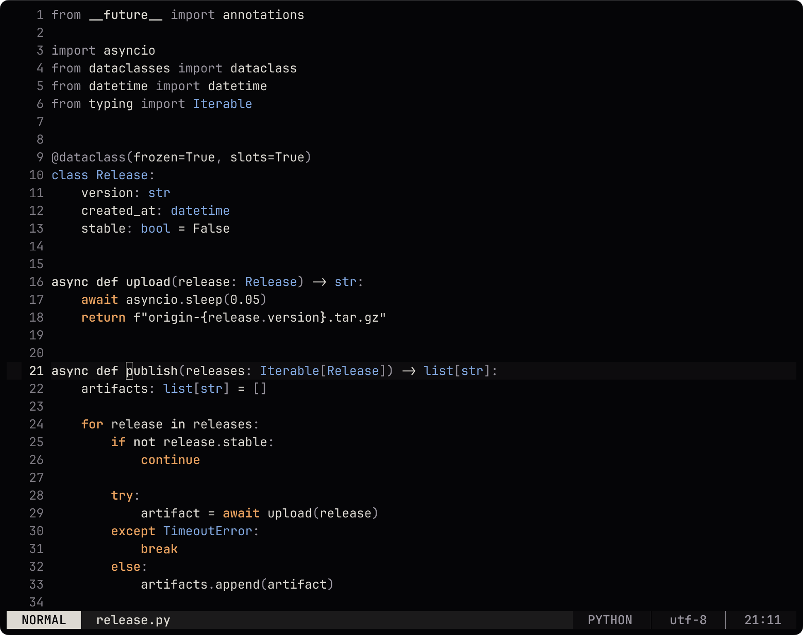

<div align="center">

# origin.nvim

A high-contrast dark colorscheme for Neovim.

[](https://github.com/phongndo/origin.nvim/actions/workflows/ci.yml)
[](LICENSE)

</div>



## Features

- Tree-sitter, LSP semantic token, and legacy Vim syntax support
- Context-aware highlighting for C++, Python, Rust, and Racket
- Built-in highlights for diagnostics, Git, diffs, completion, pickers, and common plugins
- Configurable transparency, inactive-window dimming, styles, palette, and highlight overrides
- Matching lualine and terminal themes
- No runtime dependencies
- Neovim 0.9+

## Installation

With [lazy.nvim](https://github.com/folke/lazy.nvim):

```lua
{
  "phongndo/origin.nvim",
  lazy = false,
  priority = 1000,
  config = function()
    require("origin").setup()
    vim.cmd.colorscheme("origin")
  end,
}
```

With `vim.pack` on Neovim 0.12+:

```lua
vim.pack.add({ "https://github.com/phongndo/origin.nvim" })
vim.cmd.colorscheme("origin")
```

`setup()` is optional when using the defaults:

```lua
vim.cmd.colorscheme("origin")
```

A true-color terminal is required. If needed, enable it before loading the theme:

```lua
vim.opt.termguicolors = true
```

## Configuration

Call `setup()` before `:colorscheme origin`. With `transparent = true`, the terminal background shows through editor windows, floating windows, completion menus, and supported plugin interfaces.

```lua
require("origin").setup({
  transparent = false,
  dim_inactive = false,
  terminal_colors = true,
  integrations = true,
  palette = {},
  overrides = {},
  styles = {
    comments = { italic = true },
    functions = {},
    keywords = { bold = true },
    strings = {},
    types = {},
    variables = {},
  },
})
```

### Palette and highlight overrides

```lua
require("origin").setup({
  transparent = true,
  palette = {
    corona = "#FFC06E",
    redshift = "#FF686D",
    blueshift = "#82B1FF",
  },
  styles = {
    comments = { italic = false },
    types = { bold = true },
  },
  overrides = function(colors)
    return {
      CursorLineNr = { fg = colors.corona, bold = true },
      FloatBorder = { fg = colors.ash, bg = colors.surface1 },
    }
  end,
})
```

Style values and highlight overrides accept fields supported by `nvim_set_hl()`.

## Palette

| Key | Color | Default use |
| --- | --- | --- |
| `void` | `#050507` | Background |
| `starlight` | `#DCD9D2` | Foreground and prominent UI text |
| `ash` | `#9A96A0` | Comments, punctuation, and secondary UI |
| `corona` | `#E8A15F` | Control flow, warnings, search, and changed state |
| `redshift` | `#E77E70` | Errors, conflicts, and removals |
| `blueshift` | `#82A8E0` | Types, information, and additions |

Background surfaces and dim/bright variants are generated from these values. The default foreground colors meet WCAG AAA contrast against the background.

## Lualine

A matching theme is included:

```lua
require("lualine").setup({
  options = { theme = "origin" },
})
```

Lualine also detects Origin when `theme = "auto"`.

## Integrations

Integrations are enabled by default and do not load plugin code.

| Category | Plugins |
| --- | --- |
| Pickers | Telescope, fzf-lua, snacks.nvim |
| Completion | nvim-cmp, blink.cmp |
| Git | GitSigns, Fugitive, Neogit, Diffview, git-conflict |
| File explorers | Neo-tree, nvim-tree, oil.nvim |
| UI | which-key, lazy.nvim, Mason, bufferline, noice, nvim-notify |
| Navigation | nvim-navic, dropbar, aerial, illuminate, treesitter-context |
| Editing | indent-blankline, flash, leap, rainbow-delimiters, mini.nvim |
| Content | render-markdown, todo-comments, trouble |
| Debugging | nvim-dap, nvim-dap-ui |
| Dashboards | alpha-nvim, dashboard-nvim |
| AI | Copilot, Avante, CodeCompanion |

Set `integrations = false` to disable all plugin highlight groups.

## Terminal themes

Matching themes are available for Alacritty, foot, Ghostty, iTerm2, Kitty, Konsole, Warp, WezTerm, Windows Terminal, and tmux. See [`extras/README.md`](extras/README.md) for installation instructions.

## Health check

Run the built-in health check after installation:

```vim
:checkhealth origin
```

## Development

```sh
make format
make test
make check-extras
```

See [CONTRIBUTING.md](CONTRIBUTING.md) for contribution guidelines.

## License

[MIT](LICENSE)
